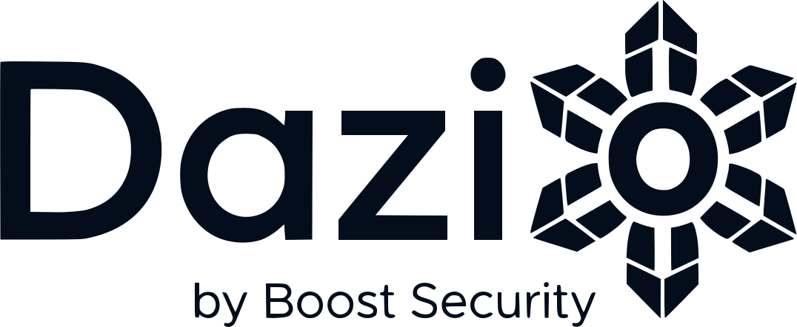

<p align="center">
  <picture>
    <source media="(prefers-color-scheme: dark)" srcset="assets/logo-dark.svg">
    
  </picture>
</p>

Dazio blocks malicious dependencies at install, finds exposed secrets before
malware does, and hardens your dev toolchain.

Free.

## What it does

- **Blocks malware at install.** Every package is checked against a local copy
  of the malware feed before it runs, and the bad ones are blocked with a note
  on what was caught. Packages that landed before Dazio did are found too.
- **Finds your exposed secrets.** API keys in files your agent wrote, tokens in
  shell history, forgotten `.env` files. Dazio reports where they are, never
  their values.
- **Hardens your toolchain.** Package managers ship with their safety settings
  off. Dazio finds each one and shows you exactly what to change.

Installs are covered for npm, yarn, bun, pip, pipx, poetry, pdm, uv, Cargo,
RubyGems, Go modules and NuGet.

## Install

Homebrew, on macOS or Linux:

```sh
brew install boostsecurityio/tap/dazio
```

Or download the archive for your platform from the
[Releases](https://github.com/boostsecurityio/dazio/releases) page:

```sh
os=$(uname -s | tr '[:upper:]' '[:lower:]')
arch=$(uname -m | sed 's/^x86_64$/amd64/; s/^aarch64$/arm64/')
tag=$(gh release view --repo boostsecurityio/dazio --json tagName -q .tagName)
gh release download "$tag" --repo boostsecurityio/dazio \
  --pattern "dazio_${tag#v}_${os}_${arch}.tar.gz" --output - | tar xz dazio
```

## First scan

```sh
dazio scan
```

The guided first scan walks you through it and prints what it found. Nothing
is installed until you say so.

`dazio scan --local` runs the scan in this process alone: it fetches,
registers and persists nothing.

## Continuous protection

```sh
dazio protect
```

One command sets up the whole thing, each part shown with what it implies
before anything is written:

- a background daemon, started at login, that keeps your scan current
- hourly malware feed updates
- alerts by email, once you follow the confirmation link
- safe-pkg, which checks every package install before it lands

Declining installs nothing.

To check one command without enabling anything:

```sh
dazio protect -- npm install
```

## Commands

```
dazio scan        the guided first scan, terse after; through the daemon when one runs
dazio result      summarize the latest scan of this machine
dazio protect     set up continuous protection: background daemon, feed updates + alerts, safe-pkg
dazio status      show daemon status
dazio feed        manage the malware feed on this machine
dazio safe-pkg    check package installs against the malware feed before they land
dazio service     manage the daemon as a login-started service
dazio reset       forget this installation: unregister, then delete identity and pending uploads
```

`dazio <command> --help` describes one command.

## Privacy

Dazio keeps the malware feed on your machine and checks packages there, so
even package names stay put. Counts leave: packages per ecosystem, number of
findings by severity. When Dazio blocks malware, it reports which threat and
which package, nothing else. Your code, your secrets and your scan results
stay with you.

`DO_NOT_TRACK=1` disables telemetry and analytics.

## Uninstall

```sh
dazio safe-pkg disable
dazio reset --yes
dazio service uninstall
brew uninstall dazio
```

## Platforms and support

macOS (Apple Silicon and Intel) and Linux (arm64 and amd64). Windows is not
supported.

Bugs and questions go to this repository's
[Issues](https://github.com/boostsecurityio/dazio/issues). The source is
closed; this repository hosts the releases.

> **Looking for more?** Boost's
> [Developer Endpoint Protection](https://boostsecurity.io/solution/developer-endpoint)
> adds central management, reporting and support on top of everything Dazio
> does.
